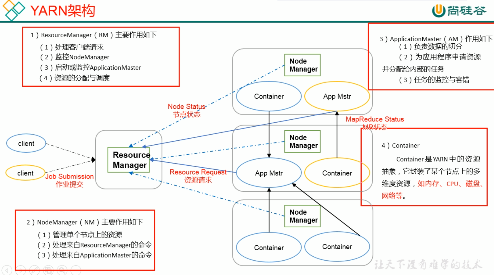

# Hadoop

## Hadoop组成
#### Hadoop 1.x && Hadoop2.x

|  Hadoop 1.x   | Hadoop 2.x  |
|  :---------  | :--------  |
| MapReduce(计算 + 资源调度)  | MapReduce(计算) |
|       | Yarn(资源调度) |
|  HDFS(数据存储)  | HDFS(数据存储) |
|  Common(辅助工具)  | Common(辅助工具) |


### HDFS
#### NameNode(nn): 
- 存储文件的元数据，如文件名，文件目录结构，文件属性(生成时间、副本数、文件权限)，以及每个文件的块列表和块所在的DataNode等。
#### DataNode(dn): 
- 在本地文件系统存储文件块数据，以及块数据的校验和。
#### Secondary NameNode(2nn): 
- 用来监控HDFS状态的辅助后台程序，每隔一段时间获取HDFS元数据的快照。

### YARN

#### ResourceManager(rm):
- 处理客户端请求
- 监控NodeManager
- 启动或监控ApplicationMaster
- 资源的分配与调度

#### NodeManager(nm):
- 管理单个节点上的资源
- 处理来自ResourceManager的命令
- 处理来自ApplicationMaster的命令

#### ApplicationMaster(am):
- 负责数据的切分
- 为应用程序申请资源并分配给内部的任务
- 任务的监控与容错

#### Container:
- Container是YARN中的资源抽象，它封装了某个节点上的多维度资源

### MapReduce
- Map阶段并行处理输入数据
- Reduce阶段对Map结果进行汇总

### capacity-scheduler
测试数据：
队列资源分配：
- root=100%
- root.default=51%
- root.tenant=49%
- root.tenant.Q1=66.6%
- root.tenant.Q2=26.7%
- root.tenant.Q3=6.67%
    - Q2.max=100%
    - 此时Q2队列正常容量为49% * 26.7% = 13.1%，可用为整个集群的13.1%的资源
    - 最大使用资源因为配置了100%，所以可以使用的是租户下一级队列的百分之百，也就是可用租户49%的100%
    - 当Q1/Q3队列空闲时，Q2及其子队列可以占用其全部资源
- 现有Q2子队列：default、t1、t2，根据队列容量配置规则，default + t1 + t2的容量之和必须等于100，因此现做配置如下
```xml
<properties>
    <property>
        <name>yarn.scheduler.capacity.root.tenant.Q2.queues</name>
        <value>default,t1,t2</value>
        <description>Q2队列划分为3个子队列</description>
    </property>
    <property>
        <name>yarn.scheduler.capacity.root.tenant.Q2.default.capacity</name>
        <value>0</value>
        <description>默认资源组，可以配置，也可以不配置</description>
    </property>
    <property>
        <name>yarn.scheduler.capacity.root.tenant.Q2.default.maximum-capacity</name>
        <value>0</value>
        <description>最大资源使用量</description>
    </property>
    <property>
        <name>yarn.scheduler.capacity.root.tenant.Q2.t1.capacity</name>
        <value>75</value>
        <description>t1队列资源容量75%，实际容量为tenant * Q2 * t1的百分比</description>
    </property>
    <property>
        <name>yarn.scheduler.capacity.root.tenant.Q2.t1.maximum-capacity</name>
        <value>100</value>
        <description>
            t1队列可用最大资源容量，此处因为Q2队列的max设置为100%，说明Q2队列最大可用资源问tenant的100%， 
        此处再将Q2.t1.max设置为100%，则此队列最大可使用资源也是tenant的100%。
        </description>
    </property>
    <property>
        <name>yarn.scheduler.capacity.root.tenant.Q2.t1.user-limit-factor</name>
        <value>10</value>
        <description>
            队列使用负载因子，限制用户最大可用资源容量。
        例如：capacity设置为20，max设置为100，user-limit-factor设置为1，此时单个作业最大可用资源容量只能是20%，
              若user-limit-factor设置为3时，则当前作业可用资源量需要参考集群总资源配置，假如当前队列配置的20%占用总资源
                的5%，5% * 3 = 15%，则当前倍数可以占用总资源量的15%，已超过当前队列配置的额定20%资源，但达不到49%的最大
                tenant资源总量，因此还可以进行超配。
              若user-limit-factor设置为10时，则当前作业可用资源量需要参考集群总资源配置，假如当前队列配置的20%占用总资源
                的5%，5% * 10 = 50%，但由于当前tenant队列最大49%的资源，此时当前队列最大可用资源不是50%，而是49%。
        </description>
    </property>
    <property>
        <name>yarn.scheduler.capacity.root.tenant.Q2.t1.minimum-user-limit-percent</name>
        <value>100</value>
        <description>
            若其他队列将此队列资源占用后，此参数可以保障当前队列可用的最小资源数。
        例如：当t2队列将资源全部占用后，t1队列有任务需要执行，此时将会按照
        </description>
    </property>
</properties>
```

